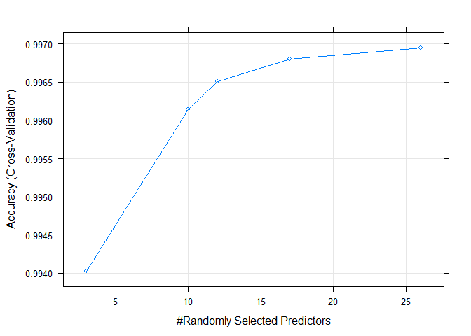

# Prediction of exercise manner using a random forest model
##Summary

The goal of this project is to use data from accelerometers on the belt, forearm, arm, and dumbell of 6 participants, to predict the manner in which they did the exercise. 

The training data is downloaded from  
https://d396qusza40orc.cloudfront.net/predmachlearn/pml-training.csv

The test data is available here: 
https://d396qusza40orc.cloudfront.net/predmachlearn/pml-testing.csv

More information is available from the website here: http://groupware.les.inf.puc-rio.br/har 

The training data and test data are cleaned by removing the variables with 50% missing values in the training data. Also the columns not related to classe are removed.

The cleaned training data is splitted into training data set and testing data set. A predictive model using random forest is develped. In the random forest model, ntree is set as 500. Another parameter mtry is tuned by using 5-folder cross validation.  The model is assessed by using the remaining testing data set. On the training and testing data, the accuracy of the model is greater than 0.995. 

Finally, the model is applied to predict the classe of the download 20 test cases.


## Data processing

```r
suppressMessages(library(caret))
```

### Loading data 

```r
# load data to stormData
training <- read.csv("pml-training.csv")
testing <- read.csv("pml-testing.csv")
```
### Preprocessing the data

```r
dim(training)
```

```
## [1] 19622   160
```

```r
dim(testing)
```

```
## [1]  20 160
```

```r
table(training$classe)
```

```
## 
##    A    B    C    D    E 
## 5580 3797 3422 3216 3607
```

```r
# remove variables with over 50% missing values in training data
drops <- NULL
for(i in names(training)){
    if (mean(is.na(training[,i]))>0.5){
        drops <- c(drops, i)
    }
}
training <- training[, !(names(training) %in% drops)]
testing <- testing[, !(names(testing) %in% drops)]

mean(!complete.cases(training))
```

```
## [1] 0
```

```r
# remove zero covariates
drops <- nearZeroVar(training)

training <- training[, -drops]
testing <- testing[, -drops]

mean(!complete.cases(testing)) 
```

```
## [1] 0
```

```r
str(training)
```

```
## 'data.frame':	19622 obs. of  59 variables:
##  $ X                   : int  1 2 3 4 5 6 7 8 9 10 ...
##  $ user_name           : Factor w/ 6 levels "adelmo","carlitos",..: 2 2 2 2 2 2 2 2 2 2 ...
##  $ raw_timestamp_part_1: int  1323084231 1323084231 1323084231 1323084232 1323084232 1323084232 1323084232 1323084232 1323084232 1323084232 ...
##  $ raw_timestamp_part_2: int  788290 808298 820366 120339 196328 304277 368296 440390 484323 484434 ...
##  $ cvtd_timestamp      : Factor w/ 20 levels "02/12/2011 13:32",..: 9 9 9 9 9 9 9 9 9 9 ...
##  $ num_window          : int  11 11 11 12 12 12 12 12 12 12 ...
##  $ roll_belt           : num  1.41 1.41 1.42 1.48 1.48 1.45 1.42 1.42 1.43 1.45 ...
##  $ pitch_belt          : num  8.07 8.07 8.07 8.05 8.07 8.06 8.09 8.13 8.16 8.17 ...
##  $ yaw_belt            : num  -94.4 -94.4 -94.4 -94.4 -94.4 -94.4 -94.4 -94.4 -94.4 -94.4 ...
##  $ total_accel_belt    : int  3 3 3 3 3 3 3 3 3 3 ...
##  $ gyros_belt_x        : num  0 0.02 0 0.02 0.02 0.02 0.02 0.02 0.02 0.03 ...
##  $ gyros_belt_y        : num  0 0 0 0 0.02 0 0 0 0 0 ...
##  $ gyros_belt_z        : num  -0.02 -0.02 -0.02 -0.03 -0.02 -0.02 -0.02 -0.02 -0.02 0 ...
##  $ accel_belt_x        : int  -21 -22 -20 -22 -21 -21 -22 -22 -20 -21 ...
##  $ accel_belt_y        : int  4 4 5 3 2 4 3 4 2 4 ...
##  $ accel_belt_z        : int  22 22 23 21 24 21 21 21 24 22 ...
##  $ magnet_belt_x       : int  -3 -7 -2 -6 -6 0 -4 -2 1 -3 ...
##  $ magnet_belt_y       : int  599 608 600 604 600 603 599 603 602 609 ...
##  $ magnet_belt_z       : int  -313 -311 -305 -310 -302 -312 -311 -313 -312 -308 ...
##  $ roll_arm            : num  -128 -128 -128 -128 -128 -128 -128 -128 -128 -128 ...
##  $ pitch_arm           : num  22.5 22.5 22.5 22.1 22.1 22 21.9 21.8 21.7 21.6 ...
##  $ yaw_arm             : num  -161 -161 -161 -161 -161 -161 -161 -161 -161 -161 ...
##  $ total_accel_arm     : int  34 34 34 34 34 34 34 34 34 34 ...
##  $ gyros_arm_x         : num  0 0.02 0.02 0.02 0 0.02 0 0.02 0.02 0.02 ...
##  $ gyros_arm_y         : num  0 -0.02 -0.02 -0.03 -0.03 -0.03 -0.03 -0.02 -0.03 -0.03 ...
##  $ gyros_arm_z         : num  -0.02 -0.02 -0.02 0.02 0 0 0 0 -0.02 -0.02 ...
##  $ accel_arm_x         : int  -288 -290 -289 -289 -289 -289 -289 -289 -288 -288 ...
##  $ accel_arm_y         : int  109 110 110 111 111 111 111 111 109 110 ...
##  $ accel_arm_z         : int  -123 -125 -126 -123 -123 -122 -125 -124 -122 -124 ...
##  $ magnet_arm_x        : int  -368 -369 -368 -372 -374 -369 -373 -372 -369 -376 ...
##  $ magnet_arm_y        : int  337 337 344 344 337 342 336 338 341 334 ...
##  $ magnet_arm_z        : int  516 513 513 512 506 513 509 510 518 516 ...
##  $ roll_dumbbell       : num  13.1 13.1 12.9 13.4 13.4 ...
##  $ pitch_dumbbell      : num  -70.5 -70.6 -70.3 -70.4 -70.4 ...
##  $ yaw_dumbbell        : num  -84.9 -84.7 -85.1 -84.9 -84.9 ...
##  $ total_accel_dumbbell: int  37 37 37 37 37 37 37 37 37 37 ...
##  $ gyros_dumbbell_x    : num  0 0 0 0 0 0 0 0 0 0 ...
##  $ gyros_dumbbell_y    : num  -0.02 -0.02 -0.02 -0.02 -0.02 -0.02 -0.02 -0.02 -0.02 -0.02 ...
##  $ gyros_dumbbell_z    : num  0 0 0 -0.02 0 0 0 0 0 0 ...
##  $ accel_dumbbell_x    : int  -234 -233 -232 -232 -233 -234 -232 -234 -232 -235 ...
##  $ accel_dumbbell_y    : int  47 47 46 48 48 48 47 46 47 48 ...
##  $ accel_dumbbell_z    : int  -271 -269 -270 -269 -270 -269 -270 -272 -269 -270 ...
##  $ magnet_dumbbell_x   : int  -559 -555 -561 -552 -554 -558 -551 -555 -549 -558 ...
##  $ magnet_dumbbell_y   : int  293 296 298 303 292 294 295 300 292 291 ...
##  $ magnet_dumbbell_z   : num  -65 -64 -63 -60 -68 -66 -70 -74 -65 -69 ...
##  $ roll_forearm        : num  28.4 28.3 28.3 28.1 28 27.9 27.9 27.8 27.7 27.7 ...
##  $ pitch_forearm       : num  -63.9 -63.9 -63.9 -63.9 -63.9 -63.9 -63.9 -63.8 -63.8 -63.8 ...
##  $ yaw_forearm         : num  -153 -153 -152 -152 -152 -152 -152 -152 -152 -152 ...
##  $ total_accel_forearm : int  36 36 36 36 36 36 36 36 36 36 ...
##  $ gyros_forearm_x     : num  0.03 0.02 0.03 0.02 0.02 0.02 0.02 0.02 0.03 0.02 ...
##  $ gyros_forearm_y     : num  0 0 -0.02 -0.02 0 -0.02 0 -0.02 0 0 ...
##  $ gyros_forearm_z     : num  -0.02 -0.02 0 0 -0.02 -0.03 -0.02 0 -0.02 -0.02 ...
##  $ accel_forearm_x     : int  192 192 196 189 189 193 195 193 193 190 ...
##  $ accel_forearm_y     : int  203 203 204 206 206 203 205 205 204 205 ...
##  $ accel_forearm_z     : int  -215 -216 -213 -214 -214 -215 -215 -213 -214 -215 ...
##  $ magnet_forearm_x    : int  -17 -18 -18 -16 -17 -9 -18 -9 -16 -22 ...
##  $ magnet_forearm_y    : num  654 661 658 658 655 660 659 660 653 656 ...
##  $ magnet_forearm_z    : num  476 473 469 469 473 478 470 474 476 473 ...
##  $ classe              : Factor w/ 5 levels "A","B","C","D",..: 1 1 1 1 1 1 1 1 1 1 ...
```

```r
# remove index (X) and timestamp column
drops <- grepl("^X|timestamp", names(training))
training <- training[, !drops]
testing <- testing[, !drops]
```

## Modeling

### Splitting the data
70% of the training data is splited into training data set. The remaining 30% is used as test data set.

```r
set.seed(1) # For reproducibile purpose
inTrain <- createDataPartition(training$classe, 
                               p=0.70, list=FALSE)
trainSet <- training[inTrain, ]
testSet <- training[-inTrain, ]
```

### Predictive model

A predictive model is developed using Random Forest algorithm, because Random Forest is accurate and can estimate the importance of the predictors. Typically mtry and ntree are two parameters which can be tuned by using train function in caret package. As shown from the help page of randomForest() function, mtry is number of variables randomly sampled as candidates at each split, and ntree is Number of trees to grow. In this model, ntree is set as 500, and 5-fold cross validation is used to tune mtry.


```r
set.seed(1)
suppressMessages(
    modRF <- train(classe ~ ., method="rf", data=trainSet,
               trControl = trainControl(method="cv", number=5,
                                        search="random"), 
               tuneLength=5)
)
```


```r
modRF
```

```
## Random Forest 
## 
## 13737 samples
##    54 predictor
##     5 classes: 'A', 'B', 'C', 'D', 'E' 
## 
## No pre-processing
## Resampling: Cross-Validated (5 fold) 
## Summary of sample sizes: 10990, 10989, 10989, 10990, 10990 
## Resampling results across tuning parameters:
## 
##   mtry  Accuracy   Kappa    
##    3    0.9940306  0.9924487
##   10    0.9961416  0.9951195
##   12    0.9965056  0.9955800
##   17    0.9967969  0.9959485
##   26    0.9969426  0.9961326
## 
## Accuracy was used to select the optimal model using  the largest value.
## The final value used for the model was mtry = 26.
```

```r
plot(modRF)
```

<!-- -->

```r
modRF$finalModel$confusion
```

```
##      A    B    C    D    E  class.error
## A 3905    0    0    0    1 0.0002560164
## B    7 2650    1    0    0 0.0030097818
## C    0    6 2389    1    0 0.0029215359
## D    0    0    8 2244    0 0.0035523979
## E    0    0    0    4 2521 0.0015841584
```

```r
modRF$finalModel$importance
```

```
##                      MeanDecreaseGini
## user_namecarlitos           12.514847
## user_namecharles            11.055835
## user_nameeurico             30.817403
## user_namejeremy              5.617433
## user_namepedro               8.837893
## num_window                1805.985806
## roll_belt                 1224.755984
## pitch_belt                 553.573851
## yaw_belt                   600.986894
## total_accel_belt            62.129827
## gyros_belt_x                33.215453
## gyros_belt_y                40.130903
## gyros_belt_z               112.703144
## accel_belt_x                37.812115
## accel_belt_y                42.176378
## accel_belt_z               211.423899
## magnet_belt_x              143.321153
## magnet_belt_y              186.756811
## magnet_belt_z              165.144209
## roll_arm                   124.925954
## pitch_arm                   65.968183
## yaw_arm                     81.949110
## total_accel_arm             32.439476
## gyros_arm_x                 40.821154
## gyros_arm_y                 51.034732
## gyros_arm_z                 14.138144
## accel_arm_x                 85.104022
## accel_arm_y                 45.845466
## accel_arm_z                 34.784653
## magnet_arm_x                89.358086
## magnet_arm_y                77.590831
## magnet_arm_z                50.318363
## roll_dumbbell              245.444202
## pitch_dumbbell              64.960071
## yaw_dumbbell               112.527608
## total_accel_dumbbell       190.222543
## gyros_dumbbell_x            41.609597
## gyros_dumbbell_y            79.408817
## gyros_dumbbell_z            21.359679
## accel_dumbbell_x           104.743397
## accel_dumbbell_y           273.421082
## accel_dumbbell_z           169.800116
## magnet_dumbbell_x          229.640765
## magnet_dumbbell_y          568.453704
## magnet_dumbbell_z          575.981095
## roll_forearm               463.007308
## pitch_forearm              773.930190
## yaw_forearm                 75.228673
## total_accel_forearm         28.179563
## gyros_forearm_x             20.697232
## gyros_forearm_y             43.172974
## gyros_forearm_z             24.973334
## accel_forearm_x            213.900515
## accel_forearm_y             44.955671
## accel_forearm_z            104.979942
## magnet_forearm_x            76.250485
## magnet_forearm_y            85.190249
## magnet_forearm_z           145.079683
```

```r
suppressMessages(predRF <- predict(modRF, testSet))
confusionMatrix(testSet$classe, predRF)
```

```
## Confusion Matrix and Statistics
## 
##           Reference
## Prediction    A    B    C    D    E
##          A 1674    0    0    0    0
##          B    1 1138    0    0    0
##          C    0    0 1026    0    0
##          D    0    0    0  964    0
##          E    0    1    0    1 1080
## 
## Overall Statistics
##                                           
##                Accuracy : 0.9995          
##                  95% CI : (0.9985, 0.9999)
##     No Information Rate : 0.2846          
##     P-Value [Acc > NIR] : < 2.2e-16       
##                                           
##                   Kappa : 0.9994          
##  Mcnemar's Test P-Value : NA              
## 
## Statistics by Class:
## 
##                      Class: A Class: B Class: C Class: D Class: E
## Sensitivity            0.9994   0.9991   1.0000   0.9990   1.0000
## Specificity            1.0000   0.9998   1.0000   1.0000   0.9996
## Pos Pred Value         1.0000   0.9991   1.0000   1.0000   0.9982
## Neg Pred Value         0.9998   0.9998   1.0000   0.9998   1.0000
## Prevalence             0.2846   0.1935   0.1743   0.1640   0.1835
## Detection Rate         0.2845   0.1934   0.1743   0.1638   0.1835
## Detection Prevalence   0.2845   0.1935   0.1743   0.1638   0.1839
## Balanced Accuracy      0.9997   0.9995   1.0000   0.9995   0.9998
```
The optimal value of mtry in the random forest model is 26. The accuracy of the model is 0.997 on the training data set. MeanDecreaseGini of the variables is listed. MeanDecreaseGini is a measure of variable importance based on the Gini impurity index used for the calculation of splits during training. From the list, we can see that top five important variables are user_namecarlitos, user_namecharles, user_nameeurico, user_namejeremy, and user_namepedro.

The accuracy of the model on the test data set is 0.9995. As expected, the random forest model has very high accuracy.

### Prediction of test cases

Finally, we apply the model to predict the classe of the original test cases. Note that the last column in testing is not in training, and is not related to classe. Therefore, it is removed while making prediction.


```r
classeTest <- predict(modRF, testing[, -55])
classeTest
```

```
##  [1] B A B A A E D B A A B C B A E E A B B B
## Levels: A B C D E
```
